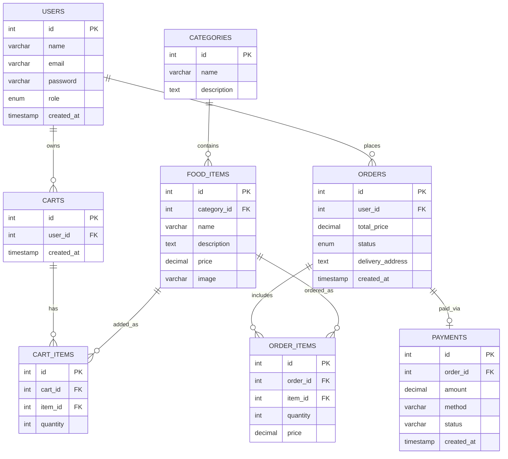

# Database Design

## Actual Database Tables
Extracted exactly from the `database.sql` schema and project models.

### `users`
* `id` (INT, PK, Auto Increment)
* `name` (VARCHAR)
* `email` (VARCHAR, Unique)
* `password` (VARCHAR)
* `role` (ENUM: 'customer', 'admin', Default: 'customer')
* `created_at` (TIMESTAMP)

### `categories`
* `id` (INT, PK, Auto Increment)
* `name` (VARCHAR)
* `description` (TEXT)

### `food_items`
* `id` (INT, PK, Auto Increment)
* `category_id` (INT, FK -> categories.id)
* `name` (VARCHAR)
* `description` (TEXT)
* `price` (DECIMAL 10,2)
* `image` (VARCHAR)

### `carts`
* `id` (INT, PK, Auto Increment)
* `user_id` (INT, FK -> users.id)
* `created_at` (TIMESTAMP)

### `cart_items`
* `id` (INT, PK, Auto Increment)
* `cart_id` (INT, FK -> carts.id)
* `item_id` (INT, FK -> food_items.id)
* `quantity` (INT, Default: 1)

### `orders`
* `id` (INT, PK, Auto Increment)
* `user_id` (INT, FK -> users.id)
* `total_price` (DECIMAL 10,2)
* `status` (ENUM: 'Pending', 'Preparing', 'Delivered', 'Cancelled', Default: 'Pending')
* `delivery_address` (TEXT)
* `created_at` (TIMESTAMP)

### `order_items`
* `id` (INT, PK, Auto Increment)
* `order_id` (INT, FK -> orders.id)
* `item_id` (INT, FK -> food_items.id)
* `quantity` (INT)
* `price` (DECIMAL 10,2)

### `payments`
* `id` (INT, PK, Auto Increment)
* `order_id` (INT, FK -> orders.id)
* `amount` (DECIMAL 10,2)
* `method` (VARCHAR, e.g., 'Cash on Delivery')
* `status` (VARCHAR, e.g., 'Pending')
* `created_at` (TIMESTAMP)

## Mermaid ER Diagram

