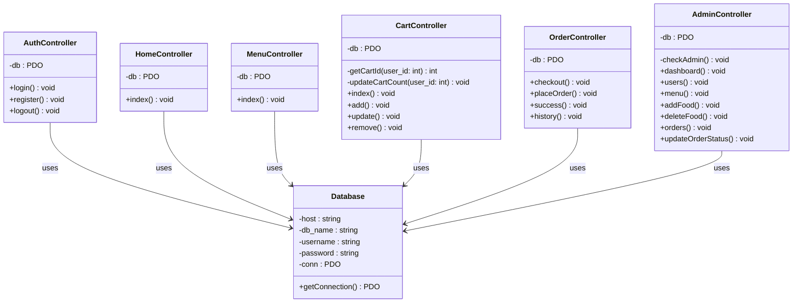

# Class Analysis

## Identified Classes
Based on the PHP MVC routing structure and controller implementations found in the `app/controllers` and `app/config` directories.

* **Database**: Handles PDO connection to MySQL.
* **AuthController**: Manages login, registration, and logout logic.
* **HomeController**: Handles the landing page rendering.
* **MenuController**: Handles displaying categories and food items.
* **CartController**: Manages adding, removing, updating, and displaying the shopping cart.
* **OrderController**: Manages checkout, order finalization, and order history viewing.
* **AdminController**: Secures admin routes and processes all admin operations (CRUD for menu, updates for orders, deletes for users).

## Mermaid Class Diagram

