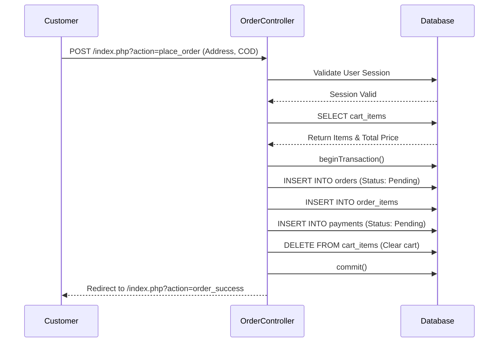
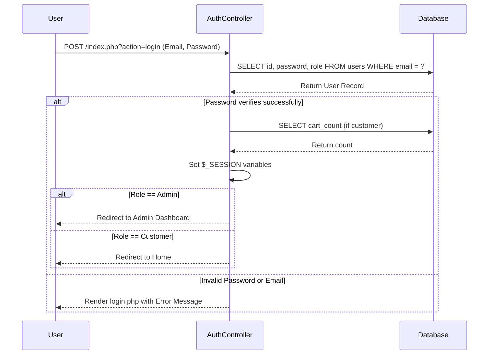

# Sequence Diagrams

## Flow 1: Order Placement Flow
**Description**: The real sequence executed when a logged-in customer finalizes their cart and places an order via Cash on Delivery.

## Flow 2: Authentication Flow (Login)
**Description**: The sequence executed when any user attempts to log into the system.

